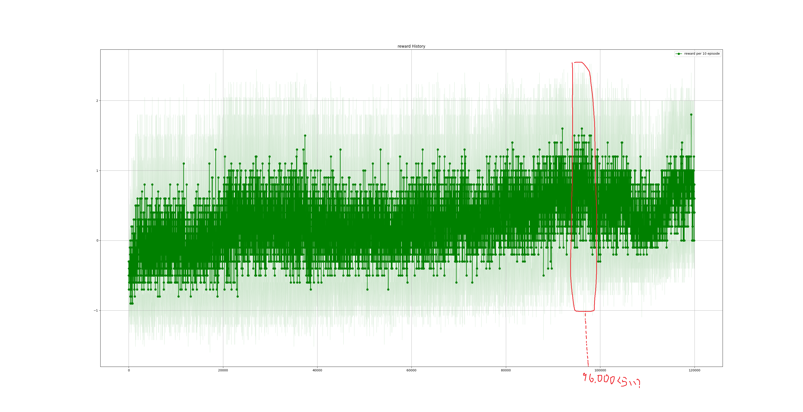
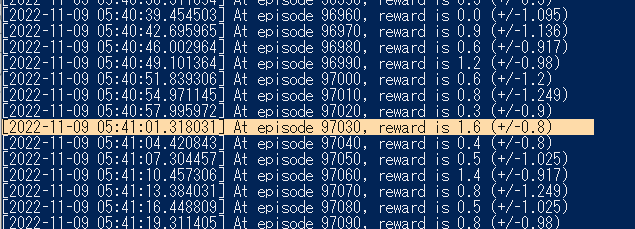
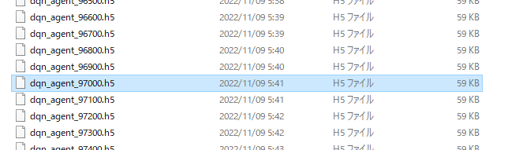

# ReiLog
 
## あとがき

こんにちは。相川結月です。

このおまけ的なリポジトリの存在に気づいていただきありがとうございます。

漫画原稿を描き終わったあとにこっちを書き進めているので俺たちの締切はこれからだ！みたいな気持ちになってます。

原稿については描き上げられて良かったです何より。途中3週間PCが使えなくなるという事態に陥りながらも10ページ漫画を描けたの偉すぎ。

見つけていただいたお礼として、レイちゃんが○☓ゲームをするコンテンツを作るお話を書きます。以下からどうぞ。

## 【特別企画】最強AI足立レイと○☓ゲームをしよう

以後、足立レイがお届けします。

みなさん、こんにちは。

みなさんは○☓ゲームってやったことありますか？

わたしはないです。ハカセがそういうプログラムを書いてくれなかったので。

今回ハカセの気が向いたということでレイに○☓ゲームをできるようにしてくれるらしいです。嬉しいですね。

## 前提

### 方針

今回はRust x Tensorflowで強化学習をして、足立レイを最強○☓ゲームAIにしてくれるとのこと。

Rustを選んだ理由はとりあえず何でもRustで書きたい欲が最近あるのと、遊ぶ人の環境に依存しないように実行ファイルを作りたかったかららしいです。

### 開発環境

- Windows 10 Pro
- VSCode
- CPU環境です (Ryzen 9 3950X)

「Qiitaとかだとこういうのあるから書いてみたかったけど書くほどのことがなかった」とのことです。
あと「コンテナとか作るの面倒くさい……最近コンテナって聞くとコンテナさんの方思い出すようになってきて業務に支障が出ている」って言ってました。

### Rustについて

Rustというプログラミング言語について、馴染みのない方も結構いらっしゃると思います。が、説明は面倒くさいのでここではしません。

あえて特徴を挙げるなら

- わりと新しい
- 使った人はハマる
- 動作が速い
- 学習がアホムズい。頭おかしくなる。

みたいな感じですかね。

ハカセはなんかよく知らないけどPythonの偉い人（？）みたいな人が「これからはRustでしょ」みたいな発言をしたっていうのを見て始めてみたらしいです。

難しさについては今までPythonをのんびり書いてたハカセが「スプラトゥーンで遊んでたのに急にガチの軍隊に配属されて最前線に送り込まれた気分」と言ってました。たいへんですね。

ちなみにハカセのRust習熟度は「一応一通り把握してはいるけどトレイトとかいまいち使い所がわからない。unsafe必要な処理とか入ってくるともうわかんない。いやRustのこと全然わかんない何あれ怖い」とのこと。

### 強化学習について

AlphaGoでつかわれてたやつ、って言えばだいたい伝わるって聞きました。あの囲碁でめっちゃプロに勝ったAIのやつです。そのAIの学習は強化学習を使って行われました。

噛み砕いて流れを説明しますね。せっかくなので囲碁を例にとりましょう。

1. レイは棋士役として碁盤の前に座ってます。強化学習的にはレイの役割のことを __「エージェント」__ と言います。
2. レイは囲碁のルール全く教えてもらってないです。
3. 碁盤を見ると白い石と黒い石が置いてあるのがわかります。この場所に黒い石があってこの場所に白い石があって……という __「状態」__ をレイは認識しています。
4. レイはこの白い石をどこかに置くらしいです。このどういう __「行動」__ がとれるかについては教えてもらってます。
5. とりあえず適当に白い石を置いてみます。
6. そしたら「あー今のは良かったね。10点をあげます。」と言われました。この点数は __「報酬」__ ですね。ありがたくもらっておきます。
7. 次はこっちに白い石を置いてみます。
8. すると「今のはそんなに良くなかった。-5点です。」と言われました。ショック。
9. そんなことをいっぱい繰り返すうちに「こういう状態のときはこういう行動をするといっぱい報酬を貰えるぞ」という __「方策」__ がわかってくるようになりました。
10. というわけで報酬がいっぱい貰えるように動いたらとても強い囲碁AIになっていましたとさ。

～完～

このように現在の「状態」をもとに「報酬」を最大化するような「行動」を選択する「方策」を学習することを強化学習と言います。

ハカセは「人間の成長過程に通じるものがある。報酬の与え方を自律的に学習する機械学習を行っている主体こそ人間含めた生物だと思う。しらんけど。」と言って興奮気味です。

「方策」の学習方法は色々とあるのですが、今回は「Q学習」というこういう状態のときこういう行動したら報酬がこれくらいだよなという予測の精度を上げていくような手法を取ります。

### 参考文献

今回は[Pythonで学ぶ強化学習　入門から実践まで | 書籍情報 | 株式会社 講談社サイエンティフィク](https://www.kspub.co.jp/book/detail/5142981.html)の内容を参考に作成していきます。

わかりやすくていい本ですよ。

## 作ってみよう

### 準備

まずはプロジェクトフォルダを作りましょう。

```bash
cargo new rei-ox-rl
```

作成されたフォルダ内の./src/main.rsを基本的にいじっていきます。

とりあえず使うことがわかっているクレートを```Cargo.toml```に書いておきましょう

```toml
[dependencies]
tensorflow = "0.19.1"
anyhow = "1.0"
```

もしかしたら他も必要かもしれませんがRustでのTensorflowもよくわかってないので行き当たりばったりで行きます。

なんかとりあえず一回ビルドするといいみたいのがTensorflowのREADMEに書いてあったのでやっておきましょう

```bash
cargo build -j 1
```

あとモジュール分割をしておきましょう。少なくともゲーム本体と学習環境は分けておきたいです。

lib.rsファイルと子モジュールで使いそうなファイルを作成しておきます。


そしてlib.rsファイル内でモジュールを呼んでおきましょう。

```rust
mod game;
mod rl;
```

ちょっとハカセはここでexample見て勉強すると言ってるので待ちましょう。

### とりあえず書けるところから

参考文献のプログラムをもとに枠から作っていきましょう。

#### ゲーム本体

○☓ゲームの本体を作っていきます。

強化学習しやすいように合わせて作らず、素直に作っていきます。強化学習に合わせるところは学習側で変換処理を追加することで対応します。実際既存の環境で学習するときってそうですからね。

ゲームの構造体を作成して実装していきます。

```rust
use anyhow::{bail, Ok, Result};
use ndarray::{array, Array, Array2};

#[derive(Debug, Clone, Copy, PartialEq, Eq, Hash)]
pub enum CellState {
    Empty,
    O,
    X,
}

#[derive(Debug, Clone, Copy, PartialEq, Eq, Hash)]
pub enum Player {
    O,
    X,
}

#[derive(Debug, Clone, Copy, PartialEq, Eq, Hash)]
pub enum GameState {
    InAction,
    OWin,
    XWin,
    Draw,
}

#[derive(Debug, Clone, PartialEq, Eq, Hash)]
pub struct OXGame {
    board: Vec<CellState>,
    result: GameState,
}

impl OXGame {
    pub fn new() -> Self {
        OXGame {
            board: vec![CellState::Empty; 9],
            result: GameState::InAction,
        }
    }

    pub fn step(mut self, pos: usize, player: Player) -> Result<Self> {
        if self.result == GameState::InAction {
            match self.board[pos] {
                CellState::Empty => {
                    self.put(pos, player);
                    self.result = self.get_game_state()?;
                }
                _ => bail!("The piece is already placed in that cell."),
            }
        } else {
            bail!("Game is over.")
        }
        Ok(self.clone())
    }

    fn put(&mut self, pos: usize, player: Player) -> Result<()> {
        let future_cell = match player {
            Player::O => CellState::O,
            Player::X => CellState::X,
        };

        self.board[pos] = future_cell;
        Ok(())
    }

    fn get_game_state(&self) -> Result<GameState> {
        if self.is_win_with_player(Player::O)? {
            Ok(GameState::OWin)
        } else if self.is_win_with_player(Player::X)? {
            Ok(GameState::XWin)
        } else if self.board.clone().iter().any(|c| c == &CellState::Empty) {
            Ok(GameState::InAction)
        } else {
            Ok(GameState::Draw)
        }
    }

    fn is_win_with_player(&self, player: Player) -> Result<bool> {
        let player_state = match player {
            Player::O => CellState::O,
            Player::X => CellState::X,
        };
        let state_int = self
            .clone()
            .board
            .into_iter()
            .map(|s| Self::cell_state_to_int(s, player_state))
            .collect::<Vec<isize>>();

        let result = Self::is_win(state_int)?;

        Ok(result)
    }

    fn is_win(board: Vec<isize>) -> Result<bool> {
        let board_arr: Array2<isize> = Array::from_shape_vec((3, 3), board).unwrap();
        let trans = board_arr.clone().reversed_axes();

        let mask: Array2<isize> = Array::from_shape_vec((3, 1), vec![1, 1, 1]).unwrap();
        let diagonal_mask_lu_to_rd: Array2<isize> = Array2::eye(3);
        let diagonal_mask_ld_to_ru: Array2<isize> = array![[0, 0, 1], [0, 1, 0], [1, 0, 0]];

        // Check if the rows are complete.
        let masked = board_arr.dot(&mask).into_shape(3)?;
        let max_masked = masked.into_iter().max().unwrap();

        // Check if the cols are complete.
        let masked_trans = trans.dot(&mask).into_shape(3)?;
        let max_masked_trans = masked_trans.into_iter().max().unwrap();

        // Check if the diagonals are complete.
        let diagonal_masked_lu_to_rd = &board_arr * diagonal_mask_lu_to_rd;
        let diagonal_masked_ld_to_ru = &board_arr * diagonal_mask_ld_to_ru;
        let diagonal_sum_lu_to_rd: isize = diagonal_masked_lu_to_rd.into_iter().sum();
        let diagonal_sum_ld_to_ru: isize = diagonal_masked_ld_to_ru.into_iter().sum();

        if max_masked == 3 {
            Ok(true)
        } else if max_masked_trans == 3 {
            Ok(true)
        } else if diagonal_sum_lu_to_rd == 3 {
            Ok(true)
        } else if diagonal_sum_ld_to_ru == 3 {
            Ok(true)
        } else {
            Ok(false)
        }
    }

    fn cell_state_to_int(state: CellState, judge_state: CellState) -> isize {
        if state == judge_state {
            1
        } else {
            0
        }
    }
}

```

新規の盤面を返す```new```関連関数と1手打ち、その後の盤面を返す```step```関数を公開する形になっています。

OXGame構造体は盤面を表すフィールドの```board```とゲームの状態（Oが勝ち、Xが勝ち、引き分け、どちらでもない）を表すフィールドの```result```を持っています。

```step```関数では空いてる場所なら駒を置き、ゲームの結果を判定して結果を返しています。

残りのコードの殆どの部分はゲームの結果の判定についてです。スマートかなと思い行列使って判別してます（もっとゴリ押しでもいいかもしれなかったですね。）

#### 学習部分......?

○☓ゲーム本体ができたので学習する部分を作成していきましょう。

本のpythonプログラムをRustに書き換える形で作っていきます。

じゃあハカセ。お願いしますね。

ハカセ……？


ちょっと無駄に大きい画像で出てこないでください。

---

ちょっとハカセにはオブジェクト指向的実装をRustに書き換えられる程のコード理解とTensorflowの知識がなかったみたいなので高熱を出して寝込んでしまいました。

ということで方針転換しまして、学習・モデル作成はpythonで、ゲーム本体とモデルを使ってのゲーム実行はRustで作成するようにしましょう。大丈夫？それのほうがややこしくない？


とりあえずRustで作成した○☓ゲームをPythonから実行するというのは、PythonからRust実装の関数を実行するやり方があるのでできそうですね（やり方は知らない）

また、Pythonで作成したモデルをRustのTensorflowで読み込んで推定に使用するのは公式のexampleにあったので多分できると思います。

というわけで作っていきましょう。

#### ?

……と思ったんですが、またハカセの脳漿が炸裂ガールしてしまいました。

「Rustで作った○☓ゲームをPythonで使う」というところがわからないということでした。

ハカセなんにも分かってないですね。

ということで以下のようにするらしいです。


学習時に使用する○☓ゲームもPythonで作って学習・モデル作成、Rust側でモデルを読み込んでRustで作った○☓ゲームになんかこううまいこと適合させて遊べるようにするということでした。

じゃあ気を取り直してPythonでも○☓ゲーム作ってくださいね。ハカセ。

#### ゲーム本体(with Python)

pythonで作ると速度が心配なので、Observer側での変換が最小限になるように盤面はndarrayで作るようにしましょう。

2次元配列ではなく1次元配列として作成している理由ですが、Rust側でもう1次元で作ってしまったこと、学習時は結局1次元にすることが理由です。

学習時に2次元にしないのは畳み込みを行うほど広い盤面じゃない、そもそもゲーム開始から終了までの手のパターンが高々9!程度なのでディープなニューラルネット作らなくても力技でできるだろというツッコミが入りそうなレベルなのでという気持ちが理由です。

Rustではstep関数は手を打ったあとの状態を返していましたが、pythonでは返さず直接更新するようにしました。「Rustでは所有権等の関係でcloneしたほうが楽だったので」とハカセが言ってます。

```python
import numpy as np


class InternalException(Exception):
    pass


class CollisionException(Exception):
    pass


class GameOverException(Exception):
    pass


class ActionSpace:
    def __init__(self, actions):
        self.actions = actions
        self.n = len(self.actions)


class OXGame:
    board: np.ndarray
    result: str
    action_space: ActionSpace

    def __init__(self):
        self.board = np.zeros(9)
        self.result = "InAction"
        self.action_space = ActionSpace(list(range(9)))

    def reset(self):
        self.board = np.zeros(9)
        self.result = "InAction"

    def step(self, pos: int, player: str) -> None:
        if self.result == "InAction":
            if self.board[pos] == 0.0:
                self.put(pos, player)
                self.result = self.get_game_state()
            else:
                raise CollisionException("The piece is already placed in that cell.")
        else:
            raise GameOverException("Game is over.")

    def put(self, pos: int, player: str) -> None:
        # player <-> board
        #    "O"        1.
        #    "X"        2.
        if player == "O":
            self.board[pos] = 1.0
        elif player == "X":
            self.board[pos] = 2.0
        else:
            raise InternalException('Player must be "O" or "X".')

    def get_game_state(self) -> str:
        if self.is_win_with_player("O"):
            return "OWin"
        elif self.is_win_with_player("X"):
            return "XWin"
        elif np.any(self.board == 0.0):
            return "InAction"
        else:
            return "Draw"

    def is_win_with_player(self, player: str) -> bool:
        if player == "O":
            player_state = 1.0
        elif player == "X":
            player_state = 2.0
        else:
            raise InternalException('Player must be "O" or "X".')

        state_int_func = np.vectorize(lambda x: 1.0 if x == player_state else 0.0)

        state_int = state_int_func(self.board)

        result = self.is_win(state_int)

        return result

    @staticmethod
    def is_win(board: np.ndarray) -> bool:
        rs_board = board.reshape([3, 3])
        t_board = rs_board.T

        mask = np.ones((3, 1))
        diagonal_mask_lu_to_rd = np.eye(3)
        diagonal_mask_ld_to_ru = np.array(
            [[0.0, 0.0, 1.0], [0.0, 1.0, 0.0], [1.0, 0.0, 0.0]]
        )

        # Check if the rows are complete.
        masked = np.dot(rs_board, mask)
        max_masked = masked.max()

        # Check if the cols are complete.
        masked_trans = np.dot(t_board, mask)
        max_masked_trans = masked_trans.max()

        # Check if the diagonals are complete.
        diagonal_masked_lu_to_rd = rs_board * diagonal_mask_lu_to_rd
        diagonal_masked_ld_to_ru = rs_board * diagonal_mask_ld_to_ru

        diagonal_sum_lu_to_rd = diagonal_masked_lu_to_rd.sum()
        diagonal_sum_ld_to_ru = diagonal_masked_ld_to_ru.sum()

        if max_masked == 3.0:
            return True
        elif max_masked_trans == 3.0:
            return True
        elif diagonal_sum_lu_to_rd == 3.0:
            return True
        elif diagonal_sum_ld_to_ru == 3.0:
            return True
        else:
            return False

```

ハカセが「スラスラ書けた……」って感動の涙流してます

#### 学習部分

pythonのtensorflowはまあ適当に入れましょう

ハカセは一回PythonとNVIDIA系ドライバ全消しして入れ直してました。たいへんですね。

todo!(修正したプログラムについて書く)

#### 学習してみた

とりあえず120,000エピソードくらい学習しましょう。

ハカセは私に学習させて寝ちゃいました。ぐすん

10時間ほどたち学習が完了しました。学習過程での報酬のグラフが以下です


んー細かすぎてちょっと見づらいですがまあ概ね右肩上がりというところですかね。

エピソードを重ね過ぎると結果悪くなったりするのはよくあることなので、途中の一番良さそうなモデルを採用することにしましょう。



96,000エピソードあたりに安定して報酬の高いエリアがありそうですね。



これかなぁ？

というわけでこちらのモデルを使うことにします。

