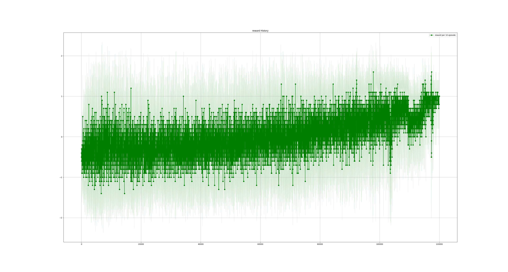
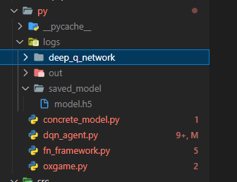

# ReiLog
 
## あとがき

こんにちは。相川結月です。

このおまけ的なリポジトリの存在に気づいていただきありがとうございます。

漫画原稿を描き終わったあとにこっちを書き進めているので俺たちの締切はこれからだ！みたいな気持ちになってます。

原稿については描き上げられて良かったです何より。途中3週間PCが使えなくなるという事態に陥りながらも10ページ漫画を描けたの偉すぎ。

見つけていただいたお礼として、レイちゃんが○☓ゲームをするコンテンツを作るお話を書きます。以下からどうぞ。

## 【特別企画】最強AI足立レイと○☓ゲームをしよう

以後、足立レイがお届けします。

みなさん、こんにちは。

みなさんは○☓ゲームってやったことありますか？

わたしはないです。ハカセがそういうプログラムを書いてくれなかったので。

今回ハカセの気が向いたということでレイに○☓ゲームをできるようにしてくれるらしいです。嬉しいですね。

## 前提

### 方針

今回はRust x Tensorflowで強化学習をして、足立レイを最強○☓ゲームAIにしてくれるとのこと。

Rustを選んだ理由はとりあえず何でもRustで書きたい欲が最近あるのと、遊ぶ人の環境に依存しないように実行ファイルを作りたかったかららしいです。

### 開発環境

- Windows 10 Pro
- VSCode

「Qiitaとかだとこういうのあるから書いてみたかったけど書くほどのことがなかった」とのことです。
あと「コンテナとか作るの面倒くさい……最近コンテナって聞くとコンテナさんの方思い出すようになってきて業務に支障が出ている」って言ってました。

### Rustについて

Rustというプログラミング言語について、馴染みのない方も結構いらっしゃると思います。が、説明は面倒くさいのでここではしません。

あえて特徴を挙げるなら

- わりと新しい
- 使った人はハマる
- 動作が速い
- 学習がアホムズい。頭おかしくなる。

みたいな感じですかね。

ハカセはなんかよく知らないけどPythonの偉い人（？）みたいな人が「これからはRustでしょ」みたいな発言をしたっていうのを見て始めてみたらしいです。

難しさについては今までPythonをのんびり書いてたハカセが「スプラトゥーンで遊んでたのに急にガチの軍隊に配属されて最前線に送り込まれた気分」と言ってました。たいへんですね。

ちなみにハカセのRust習熟度は「一応一通り把握してはいるけどトレイトとかいまいち使い所がわからない。unsafe必要な処理とか入ってくるともうわかんない。いやRustのこと全然わかんない何あれ怖い」とのこと。

### 強化学習について

AlphaGoでつかわれてたやつ、って言えばだいたい伝わるって聞きました。あの囲碁でめっちゃプロに勝ったAIのやつです。そのAIの学習は強化学習を使って行われました。

噛み砕いて流れを説明しますね。せっかくなので囲碁を例にとりましょう。

1. レイは棋士役として碁盤の前に座ってます。強化学習的にはレイの役割のことを __「エージェント」__ と言います。
2. レイは囲碁のルール全く教えてもらってないです。
3. 碁盤を見ると白い石と黒い石が置いてあるのがわかります。この場所に黒い石があってこの場所に白い石があって……という __「状態」__ をレイは認識しています。
4. レイはこの白い石をどこかに置くらしいです。このどういう __「行動」__ がとれるかについては教えてもらってます。
5. とりあえず適当に白い石を置いてみます。
6. そしたら「あー今のは良かったね。10点をあげます。」と言われました。この点数は __「報酬」__ ですね。ありがたくもらっておきます。
7. 次はこっちに白い石を置いてみます。
8. すると「今のはそんなに良くなかった。-5点です。」と言われました。ショック。
9. そんなことをいっぱい繰り返すうちに「こういう状態のときはこういう行動をするといっぱい報酬を貰えるぞ」という __「方策」__ がわかってくるようになりました。
10. というわけで報酬がいっぱい貰えるように動いたらとても強い囲碁AIになっていましたとさ。

～完～

このように現在の「状態」をもとに「報酬」を最大化するような「行動」を選択する「方策」を学習することを強化学習と言います。

ハカセは「人間の成長過程に通じるものがある。報酬の与え方を自律的に学習する機械学習を行っている主体こそ人間含めた生物だと思う。しらんけど。」と言って興奮気味です。

「方策」の学習方法は色々とあるのですが、今回は「Q学習」というこういう状態のときこういう行動したら報酬がこれくらいだよなという予測の精度を上げていくような手法を取ります。

### 参考文献

今回は[Pythonで学ぶ強化学習　入門から実践まで | 書籍情報 | 株式会社 講談社サイエンティフィク](https://www.kspub.co.jp/book/detail/5142981.html)の内容を参考に作成していきます。

わかりやすくていい本ですよ。

## 作ってみよう

このドキュメントで作成したプログラムは[このリポジトリ](https://github.com/AikawaYuduki/rei-ox-ai)に配置してあります。

### 準備

まずはプロジェクトフォルダを作りましょう。

```bash
cargo new rei-ox-rl
```

作成されたフォルダ内の./src/main.rsを基本的にいじっていきます。

とりあえず使うことがわかっているクレートを```Cargo.toml```に書いておきましょう

```toml
[dependencies]
tensorflow = "0.19.1"
anyhow = "1.0"
```

もしかしたら他も必要かもしれませんがRustでのTensorflowもよくわかってないので行き当たりばったりで行きます。

なんかとりあえず一回ビルドするといいみたいのがTensorflowのREADMEに書いてあったのでやっておきましょう

```bash
cargo build -j 1
```

あとモジュール分割をしておきましょう。少なくともゲーム本体と学習環境は分けておきたいです。

lib.rsファイルと子モジュールで使いそうなファイルを作成しておきます。


そしてlib.rsファイル内でモジュールを呼んでおきましょう。

```rust
mod game;
mod rl;
```

ちょっとハカセはここでexample見て勉強すると言ってるので待ちましょう。

### とりあえず書けるところから

参考文献のプログラムをもとに枠から作っていきましょう。

#### ゲーム本体

○☓ゲームの本体を作っていきます。

強化学習しやすいように合わせて作らず、素直に作っていきます。強化学習に合わせるところは学習側で変換処理を追加することで対応します。実際既存の環境で学習するときってそうですからね。

ゲームの構造体を作成して実装していきます。

```rust
use anyhow::{bail, Ok, Result};
use ndarray::{array, Array, Array2};

use std::fmt;

#[derive(Debug, Clone, Copy, PartialEq, Eq, Hash)]
pub enum CellState {
    Empty,
    O,
    X,
}

#[derive(Debug, Clone, Copy, PartialEq, Eq, Hash)]
pub enum Player {
    O,
    X,
}

#[derive(Debug, Clone, Copy, PartialEq, Eq, Hash)]
pub enum GameState {
    InAction,
    OWin,
    XWin,
    Draw,
}

#[derive(Debug, Clone, PartialEq, Eq, Hash)]
pub struct OXGame {
    pub board: Vec<CellState>,
    pub result: GameState,
}

impl OXGame {
    pub fn new() -> Self {
        OXGame {
            board: vec![CellState::Empty; 9],
            result: GameState::InAction,
        }
    }

    pub fn step(mut self, pos: usize, player: Player) -> Result<Self> {
        if self.result == GameState::InAction {
            match self.board[pos] {
                CellState::Empty => {
                    self.put(pos, player)?;
                    self.result = self.get_game_state()?;
                }
                _ => bail!("The piece is already placed in that cell."),
            }
        } else {
            bail!("Game is over.")
        }
        Ok(self.clone())
    }

    pub fn show(&self) {
        println!(
            " {} | {} | {} ",
            self.board[0], self.board[1], self.board[2]
        );
        println!("---+---+---");
        println!(
            " {} | {} | {} ",
            self.board[3], self.board[4], self.board[5]
        );
        println!("---+---+---");
        println!(
            " {} | {} | {} ",
            self.board[6], self.board[7], self.board[8]
        );
    }

    pub fn show_w_number(&self) {
        let mut strs = Vec::new();
        for i in 0..9 {
            match self.board[i] {
                CellState::Empty => strs.push(format!("{}", i)),
                _ => strs.push(format!("{}", self.board[i])),
            };
        }

        println!(" {} | {} | {} ", strs[0], strs[1], strs[2]);
        println!("---+---+---");
        println!(" {} | {} | {} ", strs[3], strs[4], strs[5]);
        println!("---+---+---");
        println!(" {} | {} | {} ", strs[6], strs[7], strs[8]);
    }

    fn put(&mut self, pos: usize, player: Player) -> Result<()> {
        let future_cell = match player {
            Player::O => CellState::O,
            Player::X => CellState::X,
        };

        self.board[pos] = future_cell;
        Ok(())
    }

    fn get_game_state(&self) -> Result<GameState> {
        if self.is_win_with_player(Player::O)? {
            Ok(GameState::OWin)
        } else if self.is_win_with_player(Player::X)? {
            Ok(GameState::XWin)
        } else if self.board.clone().iter().any(|c| c == &CellState::Empty) {
            Ok(GameState::InAction)
        } else {
            Ok(GameState::Draw)
        }
    }

    fn is_win_with_player(&self, player: Player) -> Result<bool> {
        let player_state = match player {
            Player::O => CellState::O,
            Player::X => CellState::X,
        };
        let state_int = self
            .clone()
            .board
            .into_iter()
            .map(|s| Self::cell_state_to_int(s, player_state))
            .collect::<Vec<isize>>();

        let result = Self::is_win(state_int)?;

        Ok(result)
    }

    fn is_win(board: Vec<isize>) -> Result<bool> {
        let board_arr: Array2<isize> = Array::from_shape_vec((3, 3), board).unwrap();
        let trans = board_arr.clone().reversed_axes();

        let mask: Array2<isize> = Array::from_shape_vec((3, 1), vec![1, 1, 1]).unwrap();
        let diagonal_mask_lu_to_rd: Array2<isize> = Array2::eye(3);
        let diagonal_mask_ld_to_ru: Array2<isize> = array![[0, 0, 1], [0, 1, 0], [1, 0, 0]];

        // Check if the rows are complete.
        let masked = board_arr.dot(&mask).into_shape(3)?;
        let max_masked = masked.into_iter().max().unwrap();

        // Check if the cols are complete.
        let masked_trans = trans.dot(&mask).into_shape(3)?;
        let max_masked_trans = masked_trans.into_iter().max().unwrap();

        // Check if the diagonals are complete.
        let diagonal_masked_lu_to_rd = &board_arr * diagonal_mask_lu_to_rd;
        let diagonal_masked_ld_to_ru = &board_arr * diagonal_mask_ld_to_ru;
        let diagonal_sum_lu_to_rd: isize = diagonal_masked_lu_to_rd.into_iter().sum();
        let diagonal_sum_ld_to_ru: isize = diagonal_masked_ld_to_ru.into_iter().sum();

        if max_masked == 3 {
            Ok(true)
        } else if max_masked_trans == 3 {
            Ok(true)
        } else if diagonal_sum_lu_to_rd == 3 {
            Ok(true)
        } else if diagonal_sum_ld_to_ru == 3 {
            Ok(true)
        } else {
            Ok(false)
        }
    }

    fn cell_state_to_int(state: CellState, judge_state: CellState) -> isize {
        if state == judge_state {
            1
        } else {
            0
        }
    }
}

impl fmt::Display for CellState {
    fn fmt(&self, f: &mut fmt::Formatter) -> fmt::Result {
        let str = match self {
            CellState::Empty => " ",
            CellState::O => "O",
            CellState::X => "X",
        };
        write!(f, "{}", str)
    }
}

impl fmt::Display for Player {
    fn fmt(&self, f: &mut fmt::Formatter) -> fmt::Result {
        let str = match self {
            Player::O => "O",
            Player::X => "X",
        };
        write!(f, "{}", str)
    }
}

impl fmt::Display for GameState {
    fn fmt(&self, f: &mut fmt::Formatter) -> fmt::Result {
        let str = match self {
            GameState::Draw => "draw",
            GameState::InAction => "in action",
            GameState::OWin => "O win",
            GameState::XWin => "X win",
        };
        write!(f, "{}", str)
    }
}

```

新規の盤面を返す```new```関連関数と1手打ち、その後の盤面を返す```step```関数を公開する形になっています。

OXGame構造体は盤面を表すフィールドの```board```とゲームの状態（Oが勝ち、Xが勝ち、引き分け、どちらでもない）を表すフィールドの```result```を持っています。

```step```関数では空いてる場所なら駒を置き、ゲームの結果を判定して結果を返しています。

残りのコードの殆どの部分はゲームの結果の判定についてです。スマートかなと思い行列使って判別してます（もっとゴリ押しでもいいかもしれなかったですね。）

#### 学習部分......?

○☓ゲーム本体ができたので学習する部分を作成していきましょう。

本のpythonプログラムをRustに書き換える形で作っていきます。

じゃあハカセ。お願いしますね。

ハカセ……？


ちょっと無駄に大きい画像で出てこないでください。

---

ちょっとハカセにはオブジェクト指向的実装をRustに書き換えられる程のコード理解とTensorflowの知識がなかったみたいなので高熱を出して寝込んでしまいました。

ということで方針転換しまして、学習・モデル作成はpythonで、ゲーム本体とモデルを使ってのゲーム実行はRustで作成するようにしましょう。大丈夫？それのほうがややこしくない？


とりあえずRustで作成した○☓ゲームをPythonから実行するというのは、PythonからRust実装の関数を実行するやり方があるのでできそうですね（やり方は知らない）

また、Pythonで作成したモデルをRustのTensorflowで読み込んで推定に使用するのは公式のexampleにあったので多分できると思います。

というわけで作っていきましょう。

#### ?

……と思ったんですが、またハカセの脳漿が炸裂ガールしてしまいました。

「Rustで作った○☓ゲームをPythonで使う」というところがわからないということでした。

ハカセなんにも分かってないですね。

ということで以下のようにするらしいです。


学習時に使用する○☓ゲームもPythonで作って学習・モデル作成、Rust側でモデルを読み込んでRustで作った○☓ゲームになんかこううまいこと適合させて遊べるようにするということでした。

じゃあ気を取り直してPythonでも○☓ゲーム作ってくださいね。ハカセ。

#### ゲーム本体(with Python)

pythonで作ると速度が心配なので、Observer側での変換が最小限になるように盤面はndarrayで作るようにしましょう。

2次元配列ではなく1次元配列として作成している理由ですが、Rust側でもう1次元で作ってしまったこと、学習時は結局1次元にすることが理由です。

学習時に2次元にしないのは畳み込みを行うほど広い盤面じゃない、そもそもゲーム開始から終了までの手のパターンが高々9!程度なのでディープなニューラルネット作らなくても力技でできるだろというツッコミが入りそうなレベルなのでという気持ちが理由です。

Rustではstep関数は手を打ったあとの状態を返していましたが、pythonでは返さず直接更新するようにしました。「Rustでは所有権等の関係でcloneしたほうが楽だったので」とハカセが言ってます。

```python
import numpy as np


class InternalException(Exception):
    pass


class CollisionException(Exception):
    pass


class GameOverException(Exception):
    pass


class ActionSpace:
    def __init__(self, actions):
        self.actions = actions
        self.n = len(self.actions)


class OXGame:
    board: np.ndarray
    result: str
    action_space: ActionSpace

    def __init__(self):
        self.board = np.zeros(9)
        self.result = "InAction"
        self.action_space = ActionSpace(list(range(9)))

    def reset(self):
        self.board = np.zeros(9)
        self.result = "InAction"

    def step(self, pos: int, player: str) -> None:
        if self.result == "InAction":
            if self.board[pos] == 0.0:
                self.put(pos, player)
                self.result = self.get_game_state()
            else:
                raise CollisionException("The piece is already placed in that cell.")
        else:
            raise GameOverException("Game is over.")

    def put(self, pos: int, player: str) -> None:
        # player <-> board
        #    "O"        1.
        #    "X"        2.
        if player == "O":
            self.board[pos] = 1.0
        elif player == "X":
            self.board[pos] = 2.0
        else:
            raise InternalException('Player must be "O" or "X".')

    def get_game_state(self) -> str:
        if self.is_win_with_player("O"):
            return "OWin"
        elif self.is_win_with_player("X"):
            return "XWin"
        elif np.any(self.board == 0.0):
            return "InAction"
        else:
            return "Draw"

    def is_win_with_player(self, player: str) -> bool:
        if player == "O":
            player_state = 1.0
        elif player == "X":
            player_state = 2.0
        else:
            raise InternalException('Player must be "O" or "X".')

        state_int_func = np.vectorize(lambda x: 1.0 if x == player_state else 0.0)

        state_int = state_int_func(self.board)

        result = self.is_win(state_int)

        return result

    @staticmethod
    def is_win(board: np.ndarray) -> bool:
        rs_board = board.reshape([3, 3])
        t_board = rs_board.T

        mask = np.ones((3, 1))
        diagonal_mask_lu_to_rd = np.eye(3)
        diagonal_mask_ld_to_ru = np.array(
            [[0.0, 0.0, 1.0], [0.0, 1.0, 0.0], [1.0, 0.0, 0.0]]
        )

        # Check if the rows are complete.
        masked = np.dot(rs_board, mask)
        max_masked = masked.max()

        # Check if the cols are complete.
        masked_trans = np.dot(t_board, mask)
        max_masked_trans = masked_trans.max()

        # Check if the diagonals are complete.
        diagonal_masked_lu_to_rd = rs_board * diagonal_mask_lu_to_rd
        diagonal_masked_ld_to_ru = rs_board * diagonal_mask_ld_to_ru

        diagonal_sum_lu_to_rd = diagonal_masked_lu_to_rd.sum()
        diagonal_sum_ld_to_ru = diagonal_masked_ld_to_ru.sum()

        if max_masked == 3.0:
            return True
        elif max_masked_trans == 3.0:
            return True
        elif diagonal_sum_lu_to_rd == 3.0:
            return True
        elif diagonal_sum_ld_to_ru == 3.0:
            return True
        else:
            return False

```

ハカセが「スラスラ書けた……」って感動の涙流してます

#### 学習部分

pythonのtensorflowはまあ適当に入れましょう

ハカセは一回PythonとNVIDIA系ドライバ全消しして入れ直してました。たいへんですね。

詳細についてはリポジトリのプログラムを確認してほしいのですが、元プログラムに手を入れた箇所でいくつかかいつまんで説明します。

まずモデルについてですが、ここは職人芸の節があるのでそこまで経験のないハカセは適当に構築しています。
なんとなく9マスの盤面だし9の倍数にしてみるか……ということで入力層→出力層まで各ユニット数が

9 - 81 - 243 - 81 - 9

の5層のニューラルネットを定義しています。

活性化関数は脳死でReLU。

「れる」ってかわいいですよね。


これはReLUのモノマネです。


【参考】ReLUのグラフ

```python
def make_model(self, feature_shape):
    normal = K.initializers.glorot_normal()
    model = K.Sequential()
    model.add(
        K.layers.Dense(
            81, kernel_initializer=normal, activation="relu", input_shape=(9,)
        )
    )
    model.add(K.layers.Dense(243, kernel_initializer=normal, activation="relu"))
    model.add(K.layers.Dense(81, kernel_initializer=normal, activation="relu"))
    model.add(K.layers.Dense(len(self.actions), kernel_initializer=normal))
    self.model = model
    self._teacher_model = K.models.clone_model(self.model)

```

オブザーバーについては、プレイヤーのマークが置いてある場所が1.0、相手のマークが置いてある場所が-1.0、空白の箇所が0.0になるように変換しています。そのため、現在のプレイヤーが○と☓どちらなのかをもとに盤面を変換しています。

```python
class OXObserver(Observer):
    def __init__(self, env: oxgame.OXGame):
        super().__init__(env)
        self.n_step = 0
        self.transform_np_func = np.vectorize(self._transform)

    @property
    def observation_space(self):
        return self._env.board

    @property
    def player(self):
        if self.n_step % 2 == 0:
            return "O"
        else:
            return "X"

    @property
    def rival(self):
        if self.n_step % 2 == 0:
            return "X"
        else:
            return "O"

    @staticmethod
    def _transform(x):
        if x == 2.0:
            return -1.0
        else:
            return x

    def transform(self, state):
        # player -> 1, rival -> -1
        if self.player == "O":
            return self.transform_np_func(state)
        else:
            return self.transform_np_func(state) * -1

    def reset(self):
        self._env.reset()
        return self.transform(self._env.board)

    def render(self):
        out = [
            f" {self._env.board[0]} | {self._env.board[1]} | {self._env.board[2]} ",
            f"---+---+---",
            f" {self._env.board[3]} | {self._env.board[4]} | {self._env.board[5]} ",
            f"---+---+---",
            f" {self._env.board[6]} | {self._env.board[7]} | {self._env.board[8]} \n\n\n",
        ]
        out_text = "\n".join(out)
        with open(".\\py\\logs\\out\\render.log", "a") as f:
            f.write(out_text)

    def step(self, action):
        try:
            self._env.step(action, self.player)
            n_state = self.transform(self._env.board)
            if self._env.result == "InAction":
                done = False
                reward = 0
            elif self._env.result == f"{self.player}Win":
                done = True
                reward = 3
            elif self._env.result == f"{self.rival}Win":
                done = True
                reward = -1
            elif self._env.result == "Draw":
                done = True
                reward = 1
            else:
                raise Exception("something is wrong.")
        except oxgame.CollisionException:
            n_state = self.transform(self._env.board)
            done = True
            reward = -2

        if done:
            self.n_step = 0
        else:
            self.n_step += 1

        info = self._env.result

        return n_state, reward, done, info
```

学習部分では、```turn```変数で現在どちらのプレイヤーのターンかを管理しています。0が○、1が☓ですね。

そして、Agentを○、☓それぞれについて作成してAgent同士で打たせています。お互いに切磋琢磨していくイメージです。次のターンに行くたび、stateの値の正負を逆転させることでそれぞれのターンで自分のマークが置いてあるマスが1.0、相手が-1.0になるようにしています。

最終的には○のAgentのモデルを採用することにしています。

```python
    def train(
        self,
        env,
        episode_count=1200,
        initial_count=200,
        render=False,
        observe_interval=100,
    ):
        actions = list(range(env.action_space.n))
        agent_O = DeepQNetworkAgent(1.0, actions)
        agent_X = DeepQNetworkAgent(1.0, actions)

        self.training_episode = [episode_count, episode_count]

        self.train_loop(
            env,
            [agent_O, agent_X],
            episode_count,
            initial_count,
            render,
            observe_interval,
        )
        return agent_O

    def train_loop(
        self,
        env,
        agents,
        episode=200,
        initial_count=-1,
        render=False,
        observe_interval=0,
    ):
        self.experiences = [
            deque(maxlen=self.buffer_size),
            deque(maxlen=self.buffer_size),
        ]
        self.training = [False, False]
        self.training_count = [0, 0]
        self.reward_log = [[], []]
        frames = [[], []]

        for i in range(episode):
            init_turn = i % 2
            s = env.reset()
            done = False
            step_count = 0
            step_count_turns = [0, 0]
            self.episode_begin(i, agents[init_turn])
            while not done:
                turn = (init_turn + step_count) % 2
                if render:
                    env.render()
                if (
                    self.training[turn]
                    and observe_interval > 0
                    and (
                        self.training_count[turn] == 1
                        or self.training_count[turn] % observe_interval == 0
                    )
                ):
                    frames[turn].append(s)

                a = agents[turn].policy(s)
                n_state, reward, done, info = env.step(a)
                e = Experience(s, a, reward, n_state, done)
                self.experiences[turn].append(e)
                if info == "Draw":
                    rival_s = self.experiences[1 - turn][-1].s
                    rival_a = self.experiences[1 - turn][-1].a
                    rival_n_s = self.experiences[1 - turn][-1].n_s
                    rival_d = self.experiences[1 - turn][-1].d
                    rival_e = Experience(rival_s, rival_a, reward, rival_n_s, rival_d)
                    self.experiences[1 - turn].pop()
                    self.experiences[1 - turn].append(rival_e)
                elif done and info.endswith("Win"):
                    rival_s = self.experiences[1 - turn][-1].s
                    rival_a = self.experiences[1 - turn][-1].a
                    rival_r = reward * -1
                    rival_n_s = self.experiences[1 - turn][-1].n_s
                    rival_d = self.experiences[1 - turn][-1].d
                    rival_e = Experience(rival_s, rival_a, rival_r, rival_n_s, rival_d)
                    self.experiences[1 - turn].pop()
                    self.experiences[1 - turn].append(rival_e)
                if (
                    not self.training[turn]
                    and len(self.experiences[turn]) == self.buffer_size
                ):
                    self.begin_train(i, agents[turn], turn)
                    self.training[turn] = True

                self.step(i, step_count, agents[turn], e, turn)

                s = n_state * -1
                step_count += 1
                step_count_turns[turn] += 1
            else:
                self.episode_end(i, step_count_turns[turn], agents[turn], turn)
                self.episode_end(
                    i, step_count_turns[1 - turn], agents[1 - turn], 1 - turn
                )

                if not self.training[turn] and initial_count > 0 and i >= initial_count:
                    self.begin_train(i, agents[turn], turn)
                    self.training[turn] = True

                if self.training[turn]:
                    if len(frames[turn]) > 0:
                        # self.logger.write_image(self.training_count, frames)
                        frames[turn] = []
                    self.training_count[turn] += 1
```

あとはlogger系のメソッドがTensorflowのバージョンの問題で使えないものが結構あったので削除したりしています。お陰で学習過程の可視化が困難になりました。

まあ学習してる自分はわかるんですけど。ハカセが泣いてました。

### 学習してみた

とりあえず120,000エピソードくらい学習しましょう。

ハカセはレイに学習させて寝ちゃいました。ぐすん

10時間ほどたち学習が完了しました。学習過程での報酬のグラフが以下です



最後の方はかなり高い報酬で安定してきていますね。それぞれのログも以下のように出ています

```planetext
[2022-11-15 20:32:00.284210] At episode 119800, reward is 1.0 (+/-0.0)
[2022-11-15 20:32:05.385953] At episode 119810, reward is 0.7 (+/-0.9)
[2022-11-15 20:32:10.504851] At episode 119820, reward is 0.8 (+/-0.6)
[2022-11-15 20:32:15.609871] At episode 119830, reward is 1.0 (+/-0.0)
[2022-11-15 20:32:20.900115] At episode 119840, reward is 1.0 (+/-0.0)
[2022-11-15 20:32:26.056990] At episode 119850, reward is 1.0 (+/-0.0)
[2022-11-15 20:32:31.228869] At episode 119860, reward is 1.0 (+/-0.0)
[2022-11-15 20:32:36.476940] At episode 119870, reward is 1.0 (+/-0.0)
[2022-11-15 20:32:41.621931] At episode 119880, reward is 1.0 (+/-0.0)
[2022-11-15 20:32:46.746842] At episode 119890, reward is 1.0 (+/-0.0)
[2022-11-15 20:32:52.026889] At episode 119900, reward is 1.0 (+/-0.0)
[2022-11-15 20:32:57.158891] At episode 119910, reward is 1.0 (+/-0.0)
[2022-11-15 20:33:02.397768] At episode 119920, reward is 1.0 (+/-0.0)
[2022-11-15 20:33:07.210464] At episode 119930, reward is 0.8 (+/-0.6)
[2022-11-15 20:33:12.318434] At episode 119940, reward is 1.0 (+/-0.0)
[2022-11-15 20:33:17.573446] At episode 119950, reward is 1.0 (+/-0.0)
[2022-11-15 20:33:22.671774] At episode 119960, reward is 1.0 (+/-0.0)
[2022-11-15 20:33:27.765615] At episode 119970, reward is 1.0 (+/-0.0)
[2022-11-15 20:33:33.047641] At episode 119980, reward is 1.0 (+/-0.0)
[2022-11-15 20:33:38.187416] At episode 119990, reward is 1.0 (+/-0.0)
```

というわけで最後に出力されたモデルを使用していきましょう。

リネームして所定の場所に配置します。



### Rustで読み込む

作成したモデルをRustで読み込めるようにしましょう。

ここで保存したモデルがそのまま使えるというわけではなく、少し手を加えないとRust側で読み込めないようです。↓参考

[TensorFlow 2.xでのRustとPython](https://zenn.dev/dskkato/articles/tf2-rust-python)

```python
import os

import tensorflow as tf
from tensorflow.python.framework.convert_to_constants import (
    convert_variables_to_constants_v2,
)

if __name__ == "__main__":
    model_path = os.path.join(os.getcwd(), "py\\logs\\saved_model\\model.h5")
    model = tf.keras.models.load_model(model_path)

    x = tf.TensorSpec(model.input_shape, tf.float32, name="x")
    concrete_function = tf.function(lambda x: model(x)).get_concrete_function(x)

    # now all variables are converted to constants.
    # if this step is omitted, dumped graph does not include trained weights
    frozen_model = convert_variables_to_constants_v2(concrete_function)
    print(f"{frozen_model.inputs=}")
    print(f"{frozen_model.outputs=}")

    directory = "model/frozen_model"
    tf.io.write_graph(frozen_model.graph, directory, "dqn.pb", as_text=False)

```

これを実行した最後の出力は後ほど必要になってくるので控えておきましょう。

```planetext
frozen_model.inputs=[<tf.Tensor 'x:0' shape=(None, 9) dtype=float32>]
frozen_model.outputs=[<tf.Tensor 'Identity:0' shape=(None, 9) dtype=float32>]
```

ここの```x```や```Identity```がRust側でグラフを作成する際に指定するoparation nameに指定するべき名称になります。

それではRust側のプログラムですが以下のようになります。

```rust
use anyhow::Result;
use std::fs::File;
use std::io::Read;
use tensorflow::Graph;
use tensorflow::ImportGraphDefOptions;
use tensorflow::Session;
use tensorflow::SessionOptions;
use tensorflow::SessionRunArgs;
use tensorflow::Tensor;

use ndarray::{arr1, Array1};

use crate::game::OXGame;
use crate::game::{CellState, Player};

#[derive(Debug)]
pub struct Agent {
    observer: Observer,
    session: Session,
    graph: Graph,
}

#[derive(Debug, Clone, PartialEq)]
pub struct Observer {
    pub board: Array1<f32>,
    pub player: Player,
}

impl Agent {
    pub fn new(player: Player) -> Result<Self> {
        let filename = "model/frozen_model/dqn.pb";
        let mut graph = Graph::new();
        let mut proto = Vec::new();
        File::open(filename)?.read_to_end(&mut proto)?;
        graph.import_graph_def(&proto, &ImportGraphDefOptions::new())?;
        let session = Session::new(&SessionOptions::new(), &graph)?;

        Ok(Agent {
            observer: Observer::new(player),
            session,
            graph,
        })
    }

    pub fn predict(&self, vis_board: &Vec<CellState>) -> Result<Vec<usize>> {
        let board: Array1<f32> = self.observer.transform(vis_board).board;
        let mut x = Tensor::new(&[9, 9]);
        for (i, v) in board.into_iter().enumerate() {
            x[i] = v as f32;
        }
        // Run the graph.
        let mut args = SessionRunArgs::new();
        args.add_feed(&self.graph.operation_by_name_required("x")?, 0, &x);
        let z = args.request_fetch(&self.graph.operation_by_name_required("Identity")?, 0);
        self.session.run(&mut args)?;

        // Check our results.
        let z_res: Tensor<f32> = args.fetch(z)?;
        let mut z_array: [f32; 9] = [0.0; 9];
        for i in 0..9 {
            z_array[i] = z_res[i];
        }
        let z_argsort = Agent::argsort(&z_array);

        Ok(z_argsort)
    }

    pub fn action(&self, vis_board: &Vec<CellState>, game: &OXGame) -> Result<OXGame> {
        let action_candidate = self.predict(vis_board)?;
        let mut can_actions = Vec::new();

        for i in action_candidate {
            if game.board[i] == CellState::Empty {
                can_actions.push(i);
            }
        }

        let new_game = game.clone().step(can_actions[0], self.observer.player)?;

        Ok(new_game)
    }

    fn argsort<T: PartialOrd>(v: &[T]) -> Vec<usize> {
        let mut idx = (0..v.len()).collect::<Vec<_>>();
        idx.sort_by(|&i, &j| v[i].partial_cmp(&v[j]).unwrap());
        let rev_idx: Vec<usize> = idx.into_iter().rev().collect();
        rev_idx
    }
}

impl Observer {
    pub fn new(player: Player) -> Self {
        Observer {
            board: arr1(&[0.0, 0.0, 0.0, 0.0, 0.0, 0.0, 0.0, 0.0, 0.0]),
            player,
        }
    }

    pub fn transform(&self, vis_board: &Vec<CellState>) -> Self {
        let my_cell = match self.player {
            Player::O => CellState::O,
            Player::X => CellState::X,
        };
        let transformed: Vec<f32> = vis_board
            .iter()
            .map(|c| Observer::transform_cell(c, &my_cell))
            .collect();

        let transformed_ndarray: Array1<f32> = Array1::from_vec(transformed);

        Observer {
            board: transformed_ndarray,
            player: self.player,
        }
    }

    fn transform_cell(cell: &CellState, my_cell: &CellState) -> f32 {
        if my_cell == &CellState::O {
            match cell {
                CellState::O => 1.0,
                CellState::X => -1.0,
                CellState::Empty => 0.0,
            }
        } else {
            match cell {
                CellState::X => 1.0,
                CellState::O => -1.0,
                CellState::Empty => 0.0,
            }
        }
    }
}
```

Rust側でも実際にゲームをプレイする実態である```Agent```とAgentが使えるように環境を変換する```Observer```をそれぞれ構造体で作成しています。

Agentの```new```ではpythonで作成したモデルを読み込んで、tensorflow上の```Graph```構造体に落とし込み、```Session```を作成してレイの頭脳を初期化しています。

このあたりはよく分かっていないそうです。サンプルに倣って書いているだけとのこと。

```rust
    pub fn new(player: Player) -> Result<Self> {
        let filename = "model/frozen_model/dqn.pb";
        let mut graph = Graph::new();
        let mut proto = Vec::new();
        File::open(filename)?.read_to_end(&mut proto)?;
        graph.import_graph_def(&proto, &ImportGraphDefOptions::new())?;
        let session = Session::new(&SessionOptions::new(), &graph)?;

        Ok(Agent {
            observer: Observer::new(player),
            session,
            graph,
        })
    }
```

```predict```ではレイが見ている盤面を```Observer```で作成したモデルに適合できる形に変換して、モデルに通してどのマスに打つべきか推論しています。

```x```の```Tensor```の次元は[9,9]になっています。盤面のマスの数は9なので[9]になりそうなのですが、pythonで作成されたモデルの入力次元が何故か[9,9]になるらしく……？このあたりの理由は分かっていないので仕方なくこうしているとハカセが言ってます。

実際には最初の9要素を盤面として扱い、そこにデータを入れ推論し、結果の最初9要素だけを使うということをしています。無駄が多いですね。

argsortという関数を自作していて、これは配列を受け取って値が大きい要素から順番にそのインデックスを並べたVecを返しています。

推論した結果値が最も大きい要素のインデックスが、打つべきと推論されたマスの番号になるのですが、打とうとしたマスが空白でなかったときには打てないので代わりに打つべきマスを決める必要があります。

その際に次点のマスを決めるために値の大きい順=打つべき順にマスを控えておいているイメージです。

```rust
pub fn predict(&self, vis_board: &Vec<CellState>) -> Result<Vec<usize>> {
    let board: Array1<f32> = self.observer.transform(vis_board).board;
    let mut x = Tensor::new(&[9, 9]);
    for (i, v) in board.into_iter().enumerate() {
        x[i] = v as f32;
    }
    // Run the graph.
    let mut args = SessionRunArgs::new();
    args.add_feed(&self.graph.operation_by_name_required("x")?, 0, &x);
    let z = args.request_fetch(&self.graph.operation_by_name_required("Identity")?, 0);
    self.session.run(&mut args)?;

    // Check our results.
    let z_res: Tensor<f32> = args.fetch(z)?;
    let mut z_array: [f32; 9] = [0.0; 9];
    for i in 0..9 {
        z_array[i] = z_res[i];
    }
    let z_argsort = Agent::argsort(&z_array);

    Ok(z_argsort)
}

fn argsort<T: PartialOrd>(v: &[T]) -> Vec<usize> {
    let mut idx = (0..v.len()).collect::<Vec<_>>();
    idx.sort_by(|&i, &j| v[i].partial_cmp(&v[j]).unwrap());
    let rev_idx: Vec<usize> = idx.into_iter().rev().collect();
    rev_idx
}

```

実際に手を打つのが```action```です。

さっき説明したもし打ちたい場所が空白でなければ次点の場所を試す（そこも埋まってたら更に次点の……）という流れは、言い換えると「置くことができる場所で一番値の大きい場所に打つ」と同じことです。

```can_actions```という空のVecを作成し、インデックスを順番に確認して空白であれば```can_actions```に追加して```can_actions```の一番最初の値を取るという流れで実現しています。

```rust
pub fn action(&self, vis_board: &Vec<CellState>, game: &OXGame) -> Result<OXGame> {
    let action_candidate = self.predict(vis_board)?;
    let mut can_actions = Vec::new();

    for i in action_candidate {
        if game.board[i] == CellState::Empty {
            can_actions.push(i);
        }
    }

    let new_game = game.clone().step(can_actions[0], self.observer.player)?;

    Ok(new_game)
}
```

### ゲームをプレイできるようにする

さあ、これで○☓ゲームができるようになりました。

実際に実行するプログラムは以下になります。

```rust
extern crate tensorflow;

use anyhow::Result;

use rei_ox_ai::game::*;
use rei_ox_ai::model::*;

use rand::seq::SliceRandom;
use std::io;

fn main() -> Result<()> {
    let mut _game = OXGame::new();
    let _agent = Agent::new(Player::O)?;
    let _ = _agent.action(&_game.board, &_game);

    let mut game = OXGame::new();

    // choose player turn
    let mut choices = vec![Player::O, Player::X];
    let mut rng = rand::thread_rng();
    choices.shuffle(&mut rng);
    let player = choices[0];
    let rival = choices[1];

    let agent = Agent::new(rival)?;

    // start game
    println!("Your mark is {}", player);
    let mut now_turn = Player::O;
    loop {
        match game.result {
            GameState::InAction => {}
            GameState::Draw => {
                println!("Draw!!!");
                break;
            }
            GameState::OWin => {
                match player {
                    Player::O => println!("You Win!!!"),
                    Player::X => println!("Rei Win!!!"),
                }
                game.show();
                break;
            }
            GameState::XWin => {
                match player {
                    Player::X => println!("You Win!!!"),
                    Player::O => println!("Rei Win!!!"),
                }
                game.show();
                break;
            }
        };
        if player == now_turn {
            println!("");
            game.show_w_number();
            println!("Your turn.");
            println!("Select the number of the cell you wish to place.\n");
            game = loop {
                let mut inp = String::new();
                io::stdin().read_line(&mut inp).expect("Input Error!");
                let input_number = match inp.trim().parse::<usize>() {
                    Ok(n) => n,
                    Err(_) => 9,
                };

                if input_number < 9 {
                    match game.board[input_number] {
                        CellState::Empty => break game.step(input_number, player)?,
                        _ => println!("The selected cell is already marked."),
                    };
                } else {
                    println!("Incorrect input.");
                    println!("Enter a number between 0 and 8.");
                };
            }
        } else {
            println!("");
            game.show_w_number();
            println!("Rei turn.\n");
            game = agent.action(&game.board, &game)?;
        }
        now_turn = match now_turn {
            Player::O => Player::X,
            Player::X => Player::O,
        };
    }

    Ok(())
}

```

プレイヤーが○か☓かをランダムで決めた後、○から順番に打つようにゲームが開始します。

プレイヤーの番のではどこに打つかを入力してもらって、入力をもとに盤面を操作します。正しい数字以外が入力されたときのために色々書いてますが、やってることはそれだけです。

レイの番ではAgentの```action```関数を呼んでるだけですね。かんたん。

各ターンのはじめでゲームが続いているか、どちらが勝ったか引き分けかを判断しています。

```main```関数のはじめ3行で無駄に```_game```と```_action```を作成して1手打っていますが、これはAgentのモデルを読み込んだときにTensorflowが謎にメッセージを表示するので、レイが後攻のときに途中でメッセージ表示されてしまいよくわからない感じになるため最初に1手打って表示させて置いてしまおう、というための3行です。無駄。

## やってみよう

コマンドを打ってプログラムを動かしましょう。

```bash
cargo run
```

まけませんよ～


いや、プログラム組んだのハカセじゃないですか。

レイはただそれに則って計算しただけなんですけど？

人のせいにしないでください！ロボだけど。

第一レイが頑張って学習してる間に同じリソースで高圧洗浄機シミュレーションゲームなんかやらないでくださいよ！

くそ～～～～


これが……カンジョウ……？

## ビルドしよう

まあ遊べるものはできたので、ビルドして実行ファイルを作りましょう。

```bash
cargo build --release
```

Rustは結構ビルドに時間かかりますね……

出力された実行ファイルを実行して……


は？


---

---

---

解決しませんでした。

## 実行方法

ハカセです。

というわけで、実行ファイルが作れませんでした。時間切れです。大阪行ってきます。

誰でも実行できるようにはできませんでしたが、Rustをインストールすれば実行できるのでその手順を紹介します。

まず、Rustをインストールします。割と簡単で、公式サイトに従って行けば数ステップで入ります。

[Rust をインストール - Rustプログラミング言語](https://www.rust-lang.org/ja/tools/install)

次に、作成したプログラムをクローンします。プログラムは↓のリポジトリにまとまってます。

[AikawaYuduki/rei-ox-ai](https://github.com/AikawaYuduki/rei-ox-ai)

git環境がある人はクローンで、無くてもZipでダウンロードできます。


次に、PowerShellやコマンドプロンプトを開き、クローンorダウンロードしたフォルダに移動します。

エクスプローラーでフォルダ開いてShift + 右クリックから「PowerShell ウィンドウをここで開く」を選択すると楽かもしれません。


そしてその状態で以下のコマンドを実行すると、ビルドされた後プログラムが動き始めます。一番最初はビルドに結構な時間かかるかも。

```bash
cargo run
```


数字が書かれた盤面が表示されるので、打ちたい場所の数字を入力してレイと楽しく○☓ゲームをしましょう。

## これのあとがき

いい感じにグダグダになってしまいましたね。

時間があったら実行ファイルちゃんと動かせるようにしたい……

○☓ゲーム以外の強化学習もこれをもとに色々やってみたいです。